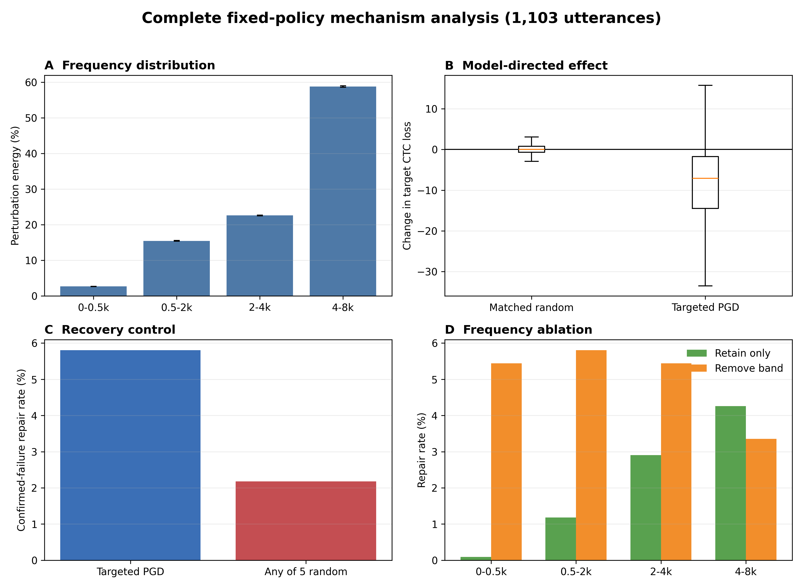
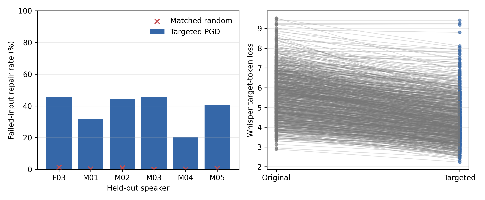
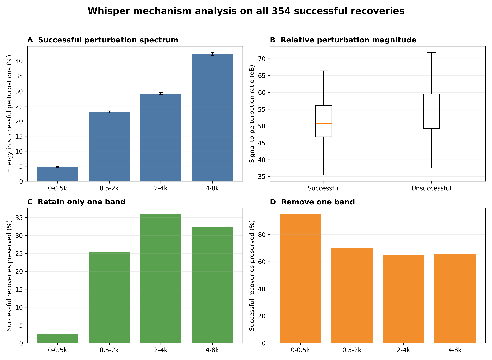
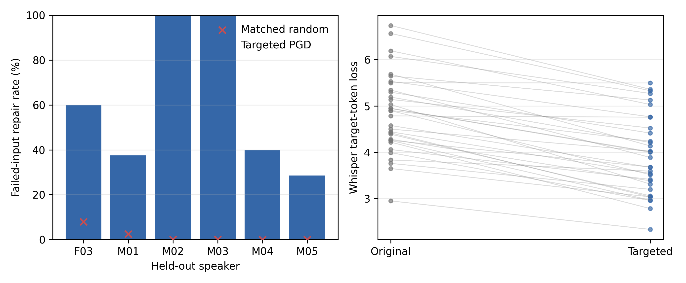

# Rebuttal Supplement

This directory contains compact, auditable analyses conducted in response to
reviewer questions about intent, parameter selection, mechanism, stronger
recognizers, and model specificity. The results should be interpreted as an
intent-provided, isolated-word, closed-vocabulary recoverability study, not as
a complete deployed interface or autonomous intent-inference system.

## Method Clarification

AdaptaVoice is a target-conditioned input transformation layer. In the offline
evaluation, the dataset label substitutes for user-confirmed intent. PGD then
computes a new bounded perturbation for the current utterance-target pair at
test time. No downstream recognizer weights, reusable conversion model,
reusable perturbation, or user representation are trained.

The adaptive pool consists only of 14 predefined hyperparameter configurations
`(epsilon, K)`, where `epsilon` bounds perturbation magnitude and `K` specifies
the number of update steps. Retrospectively selecting any successful
configuration is treated as an oracle upper bound. The non-oracle analysis
instead learns a configuration order on two development speakers and freezes
that order before evaluation on six speaker-disjoint test speakers.

## Results

### Dev-Learned, Test-Frozen Policy

On 1,212 held-out full-lexicon failed inputs, the frozen sequential policy
repairs 5.0%, 16.1%, and 23.2% at maximum query budgets of 1, 5, and 14.
Test outcomes determine only when the search stops, not the configuration
order.

Files: [`results/adaptive_policy/`](results/adaptive_policy/)

### Complementary All-Failure Wav2Vec2 Analysis

As a non-success-selected control, this analysis covers all
1,103 full-lexicon failures confirmed by length-aware decoding under the
current Wav2Vec2 runtime. A prior padded-batch confirmation identified 1,116;
length-aware decoding reclassifies 13 padding-sensitive items as already
correct. Every evaluated item uses the first dev-frozen configuration,
`epsilon=0.0002, K=3`; there is no per-item search.

Targeted PGD repairs 64/1,103 inputs (5.8%). Each of five independently paired
L-infinity/RMS-matched random seeds repairs 12-14; the largest exact paired
`p` is `1.55e-9`. Even granting random noise five attempts, any-random repairs
24/1,103 versus 64/1,103 targeted (`p=8.58e-6`). On 1,093 finite CTC pairs,
mean target loss falls from 121.971 to 112.375 (`p=2.48e-112`), while matched
random noise yields 121.945 (`p=0.26`). Ten short utterances have infinite CTC
loss because the target token sequence exceeds available output frames; they
remain in recognition and acoustic analyses.

The median signal-to-perturbation ratio is 55.3 dB. This Wav2Vec2 analysis
supports a target-directed rather than generic-noise effect on the complete
failure set. Its spectral findings are recognizer-specific and are not used
to infer the Whisper mechanism.

Files:

- [`results/mechanism_full_fixed_policy/`](results/mechanism_full_fixed_policy/)
- [`results/mechanism/`](results/mechanism/) (earlier 50-example analysis)

### Whisper Large-v3-turbo

Under the same closed-vocabulary mapping, Whisper large-v3-turbo achieves
43.9% mapped accuracy on 1,844 held-out full-lexicon utterances, leaving 1,035
failed inputs.

The primary direct-recovery analysis includes all full-lexicon failures,
without success-based subsampling. Of the 1,035 Faster-Whisper mapped failures,
950 remain failures under the differentiable implementation used for
optimization; 85 already decode correctly and do not trigger recovery.

Direct optimization uses one fixed hyperparameter configuration,
`epsilon=0.0002, K=3`, selected as the first configuration in the previously
frozen Wav2Vec2 policy. No Whisper-specific parameter search is performed. It
repairs 354/950 confirmed failures (37.3%; 95% Wilson CI 34.2-40.4%),
including 306 exact target transcriptions. Five matched random controls per
item repair 28/4,750 trials, affecting only 16/950 utterances. Targeted
recovery differs from the any-random result in the paired comparison
(`p=3.79e-97`). Target rank improves for 545/950 items (median 36.5 to 4;
`p=8.37e-47`). Under the differentiable implementation, overall mapped
accuracy rises from 48.5% to 67.7%.

Files: [`results/whisper_direct_fulllex/`](results/whisper_direct_fulllex/)

### Whisper Success-Conditioned Mechanism

We characterize all 354 successful recoveries from the complete fixed-policy
Whisper experiment above. This answers what changes are functionally involved
when recovery succeeds; efficacy and generic-noise specificity are still
evaluated without success selection on all 950 failures.

Among the successful cases, 306 are exact target transcriptions and mean
target loss falls from 5.332 to 3.869 (`p=4.54e-60`). Success is associated
with lower signal-to-perturbation ratios and larger log-spectral changes
than unsuccessful perturbations (Holm-adjusted
`p=3.18e-8` and `2.21e-7`). Although 42.3% of successful perturbation energy
lies at 4-8 kHz, unsuccessful perturbations have a similar share (41.9%;
`p=0.497`), so high-frequency energy alone is not sufficient.

Under the original L-infinity bound, retaining only 0-0.5, 0.5-2, 2-4, and
4-8 kHz preserves 9, 90, 127, and 115 of the 354 recoveries. Removing those
bands preserves 336, 247, 229, and 232. The 2-4 and 4-8 kHz effects do not
differ significantly in paired tests. These results support distributed,
target-directed contributions across approximately 0.5-8 kHz rather than
one necessary or sufficient band.

Files: [`results/whisper_success_mechanism/`](results/whisper_success_mechanism/)

The complete 10-word test setting is retained as a bounded-vocabulary
sensitivity analysis. It repairs 18/33 confirmed failures (54.5%) with 3/165
matched-random repairs. We also retain the earlier speaker-balanced
full-lexicon subset, which repairs 27/60 failures with 0/300 matched-random
repairs.

Files:

- [`results/whisper_baseline/`](results/whisper_baseline/)
- [`results/whisper_direct/`](results/whisper_direct/)
- [`results/whisper_direct_10word/`](results/whisper_direct_10word/)

### Cross-Model Transfer Limitation

A 50-pair probe provides no evidence of systematic transfer from
Wav2Vec2-optimized perturbations to Whisper. This null result limits the claim
to recognizer-specific recovery. Deployment therefore requires access to the
target recognizer or a separately validated surrogate.

Files: [`results/transfer_limitation/`](results/transfer_limitation/)

## Reproduction Materials

The analysis source snapshots are in [`scripts/`](scripts/), with dependencies
listed in [`requirements.txt`](requirements.txt). Full reruns require locally
prepared TORGO manifests and, for the adaptive analysis, the original
multi-configuration result files. These licensed/source data are not duplicated
in this supplement.

The CSV files published here are aggregate or compact condition-level
analysis outputs. Generated audio, source audio, local paths, model caches,
and smoke/pilot runs are intentionally excluded.

## Statistical Notes

- Repair confidence intervals are Wilson or bootstrap intervals as identified
  in the corresponding summaries.
- Target-loss and target-rank comparisons use paired Wilcoxon tests.
- Matched random controls preserve the relevant perturbation magnitude
  constraints described in each experiment summary.
- Speaker-level full-lexicon Whisper results are reported because repair rates
  vary from 20.1% to 45.5% across the six held-out speakers.
