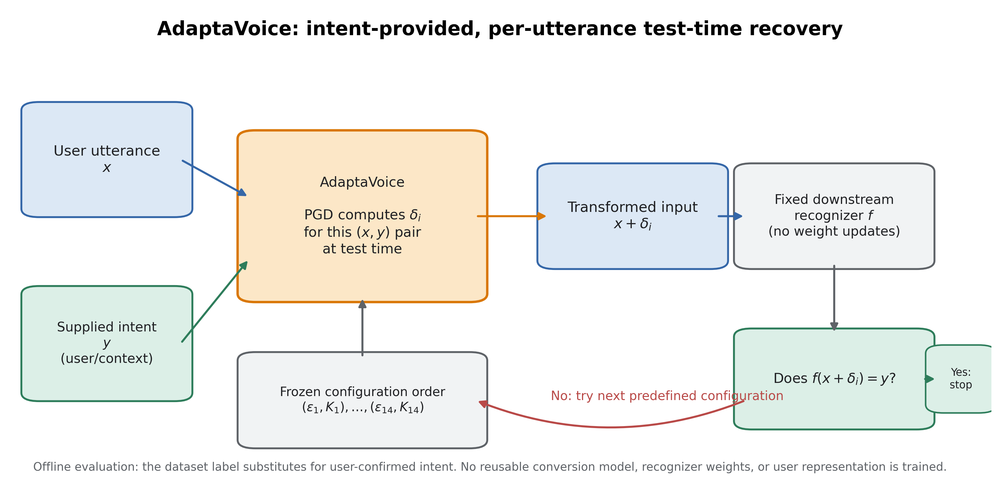
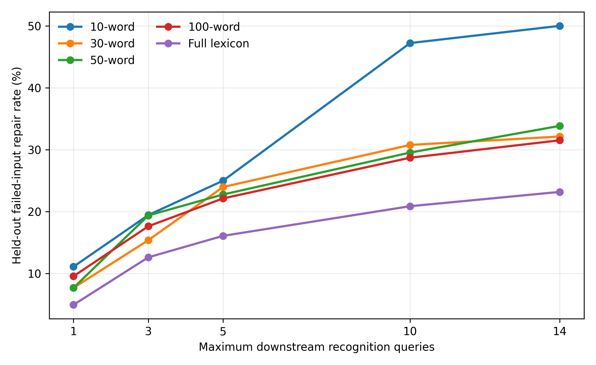
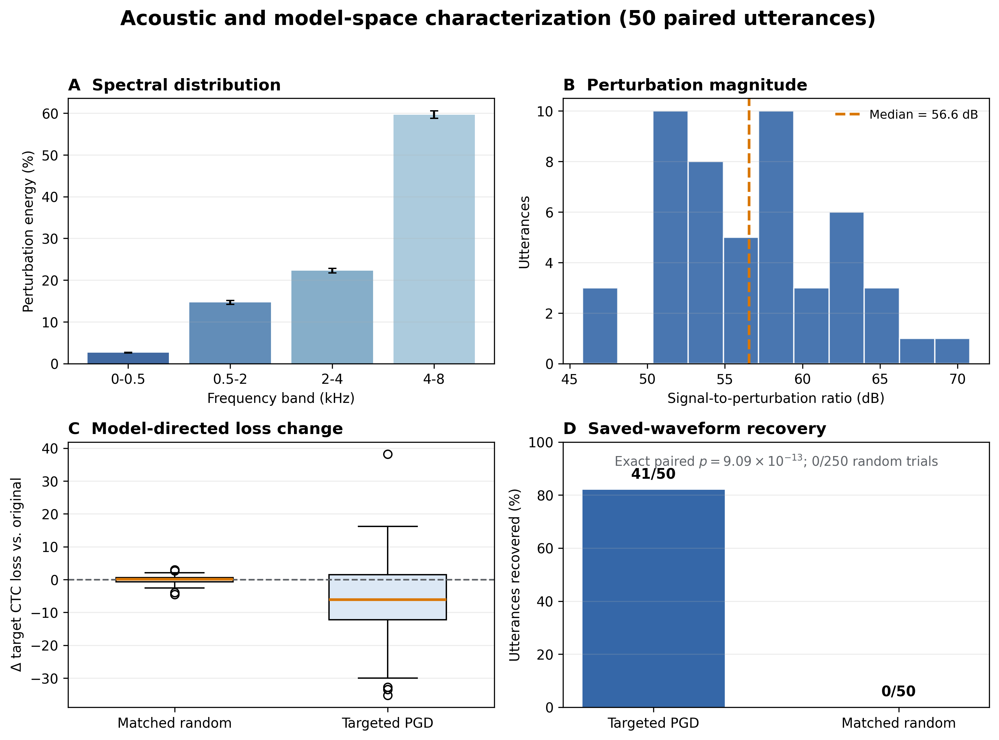
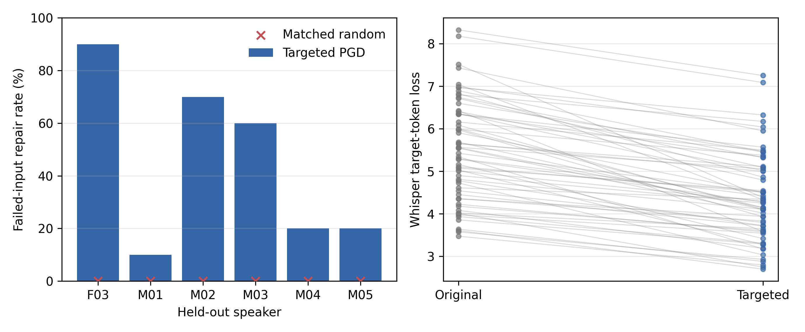

# Rebuttal Supplement

This directory contains compact, auditable analyses conducted in response to
reviewer questions about intent, parameter selection, mechanism, stronger
recognizers, and model specificity. The results should be interpreted as an
intent-provided, isolated-word, closed-vocabulary recoverability study, not as
a complete deployed interface or autonomous intent-inference system.

## Method Clarification

AdaptaVoice is a target-conditioned input transformation layer. In the offline
evaluation, the dataset label substitutes for user-confirmed intent. PGD then
computes a new bounded perturbation for the current utterance-target pair at
test time. No downstream recognizer weights, reusable conversion model,
reusable perturbation, or user representation are trained.

The adaptive pool consists only of 14 predefined hyperparameter configurations
`(epsilon, K)`, where `epsilon` bounds perturbation magnitude and `K` specifies
the number of update steps. Retrospectively selecting any successful
configuration is treated as an oracle upper bound. The non-oracle analysis
instead learns a configuration order on two development speakers and freezes
that order before evaluation on six speaker-disjoint test speakers.

## Results

### Dev-Learned, Test-Frozen Policy

On 1,212 held-out full-lexicon failed inputs, the frozen sequential policy
repairs 5.0%, 16.1%, and 23.2% at maximum query budgets of 1, 5, and 14.
Test outcomes determine only when the search stops, not the configuration
order.

Files: [`results/adaptive_policy/`](results/adaptive_policy/)

### Acoustic and Model-Space Mechanism

Across 50 paired utterances, the median signal-to-perturbation ratio is
56.6 dB and 59.7% of perturbation energy lies at 4-8 kHz. Mean target CTC loss
falls from 127.21 to 120.95 for targeted perturbations, while norm-matched
random noise yields 127.23. Saved-waveform recovery reproduces for 41/50
targeted examples, compared with 0/250 random controls.

The spectral distribution is descriptive; it does not establish that a
particular acoustic band causes recovery.

Files: [`results/mechanism/`](results/mechanism/)

### Whisper Large-v3-turbo

Under the same closed-vocabulary mapping, Whisper large-v3-turbo achieves
43.9% mapped accuracy on 1,844 held-out full-lexicon utterances, leaving 1,035
failed inputs.

Direct optimization uses a single fixed hyperparameter configuration,
`epsilon=0.0002, K=3`, selected as the first configuration in the previously
frozen Wav2Vec2 policy. No Whisper-specific parameter search is performed.
The evaluation takes the first 10 confirmed failures in dataset order for each
of six held-out speakers. It repairs 27/60 inputs; five matched random controls
per item repair 0/300.

Files:

- [`results/whisper_baseline/`](results/whisper_baseline/)
- [`results/whisper_direct/`](results/whisper_direct/)

### Cross-Model Transfer Limitation

A 50-pair probe provides no evidence of systematic transfer from
Wav2Vec2-optimized perturbations to Whisper. This null result limits the claim
to recognizer-specific recovery. Deployment therefore requires access to the
target recognizer or a separately validated surrogate.

Files: [`results/transfer_limitation/`](results/transfer_limitation/)

## Reproduction Materials

The analysis source snapshots are in [`scripts/`](scripts/), with dependencies
listed in [`requirements.txt`](requirements.txt). Full reruns require locally
prepared TORGO manifests and, for the adaptive analysis, the original
multi-configuration result files. These licensed/source data are not duplicated
in this supplement.

The CSV files published here are aggregate or compact paired-analysis outputs.
Large raw transcription files, generated audio, local paths, model caches, and
smoke/pilot runs are intentionally excluded.

## Statistical Notes

- Repair confidence intervals are Wilson or bootstrap intervals as identified
  in the corresponding summaries.
- Target-loss and target-rank comparisons use paired Wilcoxon tests.
- Matched random controls preserve the relevant perturbation magnitude
  constraints described in each experiment summary.
- Speaker-level Whisper results are reported because repair rates vary from
  10% to 90% across the six held-out speakers.
